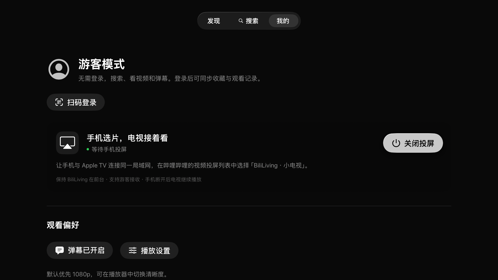
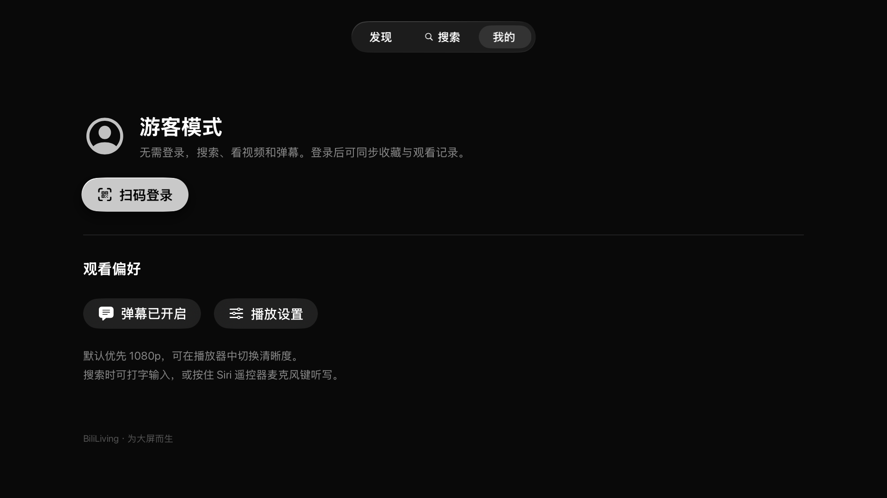

<a id="top"></a>
<p align="center">
  
</p>

<h3 align="center">好视频，坐下来慢慢看。</h3>
<p align="center">为客厅设计的 B 站 Apple TV 客户端</p>

<p align="center">
  
  
  <a href="LICENSE.md"></a>
  <a href="https://github.com/yichengchen/ATV-Bilibili-demo"></a>
</p>

<p align="center"><strong>简体中文</strong> · <a href="README.en.md">English</a></p>

<p align="center">
  <a href="#features">✨ 功能亮点</a> ·
  <a href="#preview">📺 界面预览</a> ·
  <a href="#quick-start">⚡ 快速开始</a> ·
  <a href="#casting">📱 手机投屏</a> ·
  <a href="#development">🛠 开发与贡献</a> ·
  <a href="#credits">🤝 致谢</a>
</p>

---

**BiliLiving** 把浏览、搜索、弹幕和手机投屏带到 Apple TV。打开即可游客观看，登录后获取账号推荐、访问收藏和观看历史，用遥控器就能完成日常操作。

> 基于 [ATV-Bilibili-demo](https://github.com/yichengchen/ATV-Bilibili-demo) 的社区衍生版本，重点改进游客浏览、客厅首页和投屏体验。播放器、接口、弹幕等核心能力继承自上游。非哔哩哔哩官方客户端。

## 最近更新

- **2026-09-15** — 登录账号推荐首页、游客热门分页；默认画质改为“最佳可用”，播放器新增关注博主入口。
- **2026-09-14** — 改进手机投屏接力与控制，补齐 DLNA SOAP 播放路径、视频识别和弹幕恢复。

实现与验证记录见 [测试说明](docs/TESTING.md)。

<a id="features"></a>

## 功能亮点

| | 在电视上能做什么 |
| :--- | :--- |
| 🛋 **打开就看** | 无需扫码即可浏览、搜索、播放和看弹幕；收藏、关注等账号操作会按需提示登录。 |
| 🎞 **客厅首页** | 大幅封面、三列视频卡片与遥控器焦点导航；登录看账号推荐，游客看热门，支持分页和换一批。 |
| 🔎 **原生搜索** | 使用 tvOS 键盘输入，支持 Siri Remote 系统听写；可用性取决于设备语言、地区和设置。 |
| ▶️ **原生播放** | AVKit 播放控制、画质切换、倍速和缓冲偏好；新安装默认选择当前账号和视频的最佳可用画质。 |
| 💬 **弹幕随行** | 真实视频弹幕默认开启、上半屏显示，可在播放器中开关和调整。 |
| 📱 **手机选片，电视接着看** | 接收 B 站手机 App 投屏，接续进度，支持暂停、继续和跳转；手机断开后电视继续播放。 |
| 🔐 **自己的观看空间** | 扫码登录、收藏、历史、稍后再看及关注博主；令牌与账号 Cookie 保存在设备 Keychain。 |

<a id="preview"></a>

## 界面预览

<p align="center">
  
</p>

<table>
  <tr>
    <td width="50%"><br><strong>播放与弹幕</strong></td>
    <td width="50%"><br><strong>视频详情</strong></td>
  </tr>
  <tr>
    <td width="50%"><br><strong>手机投屏</strong></td>
    <td width="50%"><br><strong>游客与账号</strong></td>
  </tr>
</table>

截图来自早期开发版本；其中“1080p 优先”等文案可能与当前版本不同，请以功能说明为准。

<a id="quick-start"></a>

## 快速开始

当前提供源码构建方式，尚未发布到 App Store 或 TestFlight。

### 在模拟器运行

准备好 macOS、Xcode 和已安装的 tvOS Simulator runtime，然后克隆项目：

```sh
git clone https://github.com/sixpluszero/BiliLiving.git
cd BiliLiving
open BilibiliLive.xcodeproj
```

等待 Swift Package Manager 解析依赖，选择 **BilibiliLive** scheme 和 Apple TV 模拟器，点击 **Run**。项目保留上游 target 名称，安装后的应用名为 **BiliLiving**。

也可以使用脚本。先列出本机模拟器，再将占位符替换为对应 Apple TV 模拟器的 UDID：

```sh
DEVELOPER_DIR=/Applications/Xcode.app/Contents/Developer xcrun simctl list devices available
export BILILIVING_SIMULATOR_ID="<APPLE_TV_SIMULATOR_UDID>"
./scripts/run-simulator.sh
```

脚本默认使用 `/Applications/Xcode.app`，可通过 `DEVELOPER_DIR` 覆盖，无需更改全局 `xcode-select`。已有验证环境为 Xcode 26.6 / tvOS 26.5 / Apple TV 4K（第 3 代，1080p）模拟器。

### 安装到 Apple TV

在 Xcode 中连接并选择自己的 Apple TV，在 **Signing & Capabilities** 中选择开发团队；如签名需要，修改 Bundle Identifier（默认 `com.jialin.BiliLiving`）。完成签名配置后运行。

### 开始观看

1. 打开后直接进入首页，以游客身份浏览，或在 **我的 → 扫码登录** 中用手机 B 站确认登录。
2. 进入 **搜索** 输入关键词，选择视频查看详情并播放。
3. 在播放器控制栏调整清晰度、弹幕或倍速；手动画质切换会保留进度和暂停状态。
4. 登录后从 **我的** 访问收藏、历史和稍后再看，或在播放器中关注博主。

模拟器使用方向键、Return 和 Escape 操作。Siri Remote 听写需要真机验证；它是键盘听写功能，不是系统全局 Siri 搜索集成。

<a id="casting"></a>

## 手机投屏

1. 手机与 Apple TV 连接同一局域网，并保持 BiliLiving 在前台。
2. 在 **我的** 页面确认投屏已开启、状态为“等待手机投屏”。
3. 在手机哔哩哔哩 App 中打开视频，点击投屏，选择 **BiliLiving · 小电视**。
4. 在电视上接着看，用手机暂停、继续或拖动进度。

新安装默认开启投屏，升级保留原开关。游客也可接收投屏；手机账号不会自动登录到电视，电视重新取流时的权限与画质以电视账号为准。此功能不是 AirPlay 接收。

协议支持、连接排查和验证记录见 [投屏说明](docs/CASTING.md)。

<a id="development"></a>

## 开发与贡献

欢迎提交修复、体验改进和文档更新。描述问题时，请注明 tvOS 版本、设备、登录状态和复现步骤；投屏问题也请附手机系统与 B 站 App 版本。日志请先移除令牌、Cookie 和带签名的视频链接。

使用上面配置好的模拟器运行测试：

```sh
./scripts/test-simulator.sh
```

部分测试会访问真实 B 站接口或局域网，结果受网络和服务端变化影响。当前记录中仍有投屏组播发现测试超时，不能视为全套测试全部通过；会员画质和特定手机／电视组合也需要实机验证。

| 文档 | 内容 |
| :--- | :--- |
| [测试记录](docs/TESTING.md) | 已验证能力、构建记录和待验证项目 |
| [投屏说明](docs/CASTING.md) | 使用方式、NVA / DLNA 实现与兼容性边界 |
| [缓冲策略](docs/PLAYBACK-BUFFERING.md) | 播放缓冲偏好与相关实现 |

画质菜单只展示服务端对当前视频和账号返回的可用档位，不绕过会员或区域限制。收藏、历史和账号授权最终确认需要实际登录；模拟器测试不能覆盖所有真机行为。

<a id="credits"></a>

## 致谢与许可证

感谢 [yichengchen/ATV-Bilibili-demo](https://github.com/yichengchen/ATV-Bilibili-demo) 及其贡献者提供播放器、B 站接口、弹幕、账号和投屏基础。BiliLiving 在此基础上维护客厅界面和体验改进，保留上游提交历史与版权声明。

- **上游基线**：[706aa63](https://github.com/yichengchen/ATV-Bilibili-demo/commit/706aa63aee68571700f4c09132b99c691427b93a)，记录于 [UPSTREAM-COMMIT](docs/UPSTREAM-COMMIT)。
- **原项目介绍**：[上游 README](docs/UPSTREAM-README.md)。
- **许可证**：[GPL-2.0](LICENSE.md)。分发修改版本时请遵守许可证；发布 IPA 时一并提供对应完整源码与构建脚本。

<p align="center"><a href="#top">回到顶部 ↑</a></p>
